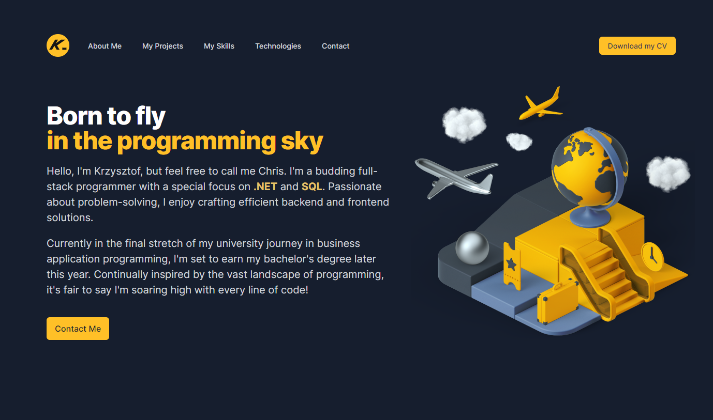

<div align="center">
    <h1>Clinic Pulse</h1>
    <h3>
        <a href="#preview">
            Preview
        </a>
        <span> | </span>
        <a href="#quickstart">
            Quickstart
        </a>
        <span> | </span>
        <a href="https://github.com/chrisonoo/ClinicPulse">
            GitHub
        </a>
    </h3>
    <p>Comprehensive clinic management application</p>
    <p><b>Status:</b> Project under development</p>
    <br>
    <p>Technologies and tools:</p>
    <p>
        
        
        
        
        
        
        
        
        
        
        
        <br/>
        
        
        
        
        
        
        
        
        
        
    </p>
</div>

<h2 id="table-of-contents">Table of Contents</h2>

- [Description](#description)
- [Preview](#preview)
- [Quickstart](#quickstart)
- [Functionality](#functionality)
- [Database Schema](#database-schema)
- [Feature List](#feature-list)
- [Technologies, Tools, Strategies and Programming Techniques](#technologies-tools-strategies-and-programming-techniques)
- [Dependencies](#dependencies)
- [Workflow](#workflow)
- [Summary](#summary)
- [Known Issues](#known-issues)
- [Contribution Guidelines](#contribution-guidelines)
- [License](#license)
- [About Me](#about-me)

## Description

`Clinic Pulse` is a comprehensive management application tailored for the healthcare industry, built using `ASP.NET Core 6 MVC` and `ASP.NET Core 6 Web API`, coupled with a robust `MSSQL` database. Designed to streamline the administrative duties of clinics, it also provides an intuitive and secure platform for patients and doctors. The app facilitates everything from scheduling appointments, managing patient records, to tracking doctor's schedules, thereby enhancing overall healthcare delivery. Whether you're a healthcare provider seeking efficiency or a patient desiring convenience, Clinic Pulse offers an all-in-one solution to modernize the healthcare experience.

[[top](#table-of-contents)]

## Preview

Remember! The application `is not finished` and may have many errors. I'm still developing it, so most often a new version lands on GitHub and hosting every day. If logins and passwords are provided for the application, you can frolic changing whatever you want.

```
    LOGIN       admim@test.com
    PASSWORD:   TEst!@12
```

### Local way to run the project on computer

There are two ways to run the application. You can do it locally on your computer, in a maximum of 10 minutes. You don't even have to install MSSQL, because Visual Studio has built-in support for simple databases. This method is discussed in the Quickstart section.

Check how to run the application locally: [Clinic Pulse Local](#quickstart).

### Online version of the application

> The application may contain errors, do not submit any sensitive data there. I bear no responsibility for any data loss, and you use the application at your own risk, waiving any claims.

Check application online: [Clinic Pulse Online](https://clinic.onoo.app/).

[[top](#table-of-contents)]

## Quickstart

... under development

[[top](#table-of-contents)]

## Functionality

... under development

[[top](#table-of-contents)]

## Database Schema

... under development

[[top](#table-of-contents)]

## Feature List

... under development

[[top](#table-of-contents)]

## Technologies, Tools, Strategies and Programming Techniques

... under development

[[top](#table-of-contents)]

## Dependencies

... under development

[[top](#table-of-contents)]

## Workflow

```
⬜    - Task pending
⬜ ⏳ - Task in progress
✅    - Task completed
```

- [ ] ⏳ Plan the application project
    - [ ] ⏳ Define the goals of the application
    - [ ] ⏳ Define the features of the application
    - [x] Choose the technology and architecture of the application
    - [ ] ⏳ Design the database
    - [ ] ⏳ Design the UI/UX
    - [ ] ⏳ Plan the work and create a Workflow
- [ ] ⏳ Prepare application infrastructure
    - [x] Create a project on GitHub
    - [x] Prepare an informational page
    - [x] Configure a subdomain for the application on [onoo.app](https://onoo.app/)
    - [x] Add application to the Showroom [clinic.onoo.app](https://clinic.onoo.app/)
    - [ ] Create solution structure in Visual Studio 2022
        - [ ] Add project ASP.NET Core 6 MVC to solution

[[top](#table-of-contents)]

## Summary

... under development

[[top](#table-of-contents)]

## Known Issues

... under development

[[top](#table-of-contents)]

## Contribution Guidelines

... under development

[[top](#table-of-contents)]

## License

... under development

[[top](#table-of-contents)]

## About Me

Hello, I'm Krzysztof, but feel free to call me Chris. I'm a budding full-stack programmer with a special focus on **.NET** and **SQL**. Passionate about problem-solving, I enjoy crafting efficient **backend** and **frontend** solutions.

As an emerging software developer, I'm keen to apply my knowledge and skills in a professional setting. I'm excited to bring my life and professional experience, providing a unique perspective to software development tasks. Eager to commence my journey in the industry, I am **actively seeking employment opportunities** where I can continue to grow and create.

Check out my [Portfolio](https://onoo.no/portfolio) or connect with me on [LinkedIn](https://www.linkedin.com/in/k-p-z/).

[[top](#table-of-contents)]

[<div align="center"><br/></div>](https://onoo.no/portfolio)

